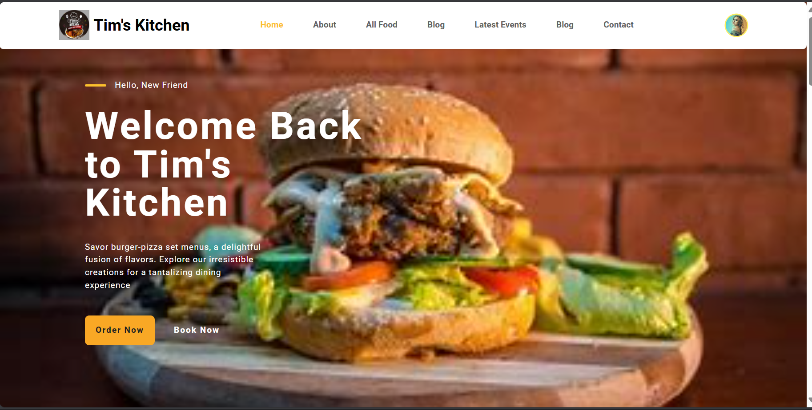
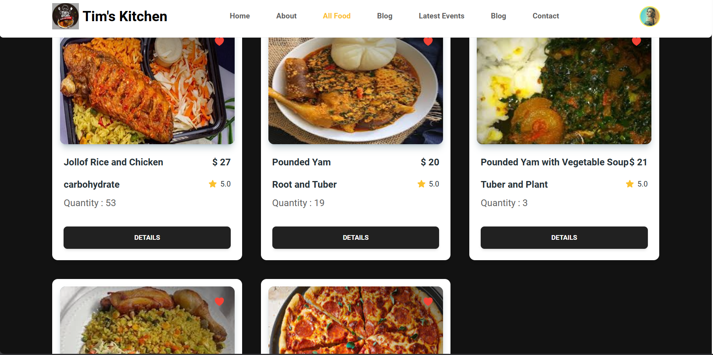
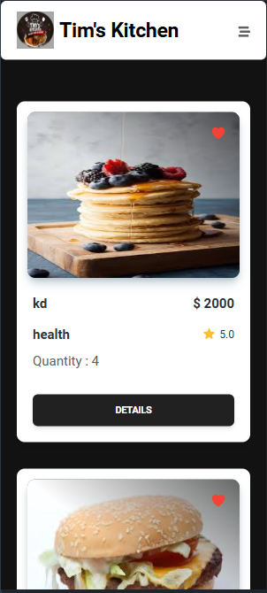

# Tim's Kitchen Restaurant | Frontend

<div align="center">
  
  <h3 align="center">A Delicious Food Ordering Platform</h3>
  
  <p align="center">
    <a href="https://timskitchen.vercel.app/">View Demo</a>
    ·
    <a href="https://github.com/freshpex/timkitchenFrontend/issues">Report Bug</a>
    ·
    <a href="https://github.com/freshpex/timkitchenFrontend/issues">Request Feature</a>
  </p>
</div>

## 📸 Screenshots

<div align="center">
  
  
</div>

<div align="center">
  
  
</div>

## 🍽️ About The Project

Tim's Kitchen is a modern food ordering platform where customers can browse, order, and pay for delicious food items. Chefs can also add and manage their food offerings. The platform includes features like real-time payment processing, WhatsApp integration for order customization, and user account management.

### ✨ Key Features

**For Customers**

- Browse a wide variety of food items with detailed descriptions
- Filter food items by category, price, and origin
- Add food items to cart and place orders
- Multiple payment options via Flutterwave or direct chat with chef
- Track order history and status
- User authentication and profile management

**For Chefs/Admins**

- Add, edit, and remove food items
- Upload food images directly or via URL
- Track food inventory and order statistics
- Manage orders and customer communications
- Profile and settings management

## 🛠️ Built With

- [React](https://reactjs.org/) - UI Library
- [Redux Toolkit](https://redux-toolkit.js.org/) - State Management
- [React Router](https://reactrouter.com/) - Routing
- [Firebase](https://firebase.google.com/) - Authentication
- [Supabase](https://supabase.io/) - Image Storage
- [Flutterwave](https://flutterwave.com/) - Payment Processing
- [TailwindCSS](https://tailwindcss.com/) - Styling
- [Vite](https://vitejs.dev/) - Build Tool

## 🚀 Getting Started

### Prerequisites

- Node.js (v14 or higher)
- npm or yarn
- Firebase account
- Supabase account
- Flutterwave account (for payment processing)

### Installation

1. Clone the repository

   ```sh
   git clone https://github.com/freshpex/timkitchenFrontend.git
   ```

2. Navigate to the project directory

   ```sh
   cd timkitchenFrontend
   ```

3. Install dependencies

   ```sh
   npm install
   # or
   yarn
   ```

4. Create a `.env` file in the root directory based on `.env.example`

   ```
   # API Configuration
   VITE_API_URL=http://localhost:5000/api

   # Firebase Configuration
   VITE_API_KEY=your_firebase_api_key
   VITE_AUTH_DOMAIN=your-project-id.firebaseapp.com
   VITE_PROJECT_ID=your-project-id
   VITE_STORAGE_BUCKET=your-project-id.appspot.com
   VITE_MESSAGING_SENDER_ID=your_messaging_sender_id
   VITE_APP_ID=1:your_app_id:web:your_web_app_id

   # Payment Gateway (Flutterwave)
   VITE_FLUTTERWAVE_PUBLIC_KEY=FLWPUBK_TEST-your-public-key-here-X

   # Supabase Configuration
   VITE_SUPABASE_URL=https://your-project-id.supabase.co
   VITE_SUPABASE_ANON_KEY=your_supabase_anon_key
   VITE_SUPABASE_BUCKET_NAME=your_bucket_name
   ```

5. Start the development server

   ```sh
   npm run dev
   # or
   yarn dev
   ```

6. Open [http://localhost:5173](http://localhost:5173) in your browser

## 📁 Project Structure

```
timkitchenFrontend/
├── public/                  # Public assets
├── src/
│   ├── Components/          # Reusable components
│   ├── Firebase/            # Firebase configuration
│   ├── MainLayout/          # Layout components
│   ├── Pages/               # Page components
│   │   ├── AddFood/         # Add food page
│   │   ├── Food/            # Food listing page
│   │   ├── FoodOrder/       # Food order page
│   │   └── ...              # Other pages
│   ├── redux/               # Redux store and slices
│   │   ├── slices/          # Redux slices
│   │   └── store.js         # Redux store configuration
│   ├── utils/               # Utility functions
│   ├── App.jsx              # Main app component
│   └── index.css            # Global styles
├── .env                     # Environment variables
├── .gitignore               # Git ignore file
├── package.json             # Project dependencies
└── vite.config.js           # Vite configuration
```

## 🔄 State Management

The application uses Redux Toolkit for state management. The store is organized into the following slices:

- `authSlice`: Manages user authentication state
- `foodSlice`: Manages food item data
- `foodActionsSlice`: Manages actions related to food (adding, ordering, etc.)
- `uiSlice`: Manages UI state (loading, modals, etc.)

## 🔐 Authentication

User authentication is handled by Firebase Authentication. The application supports:

- Email/password authentication
- Google sign-in
- Password reset

## 📤 Image Upload

Food images can be uploaded in two ways:

1. Direct file upload to Supabase
2. URL input

## 💰 Payment Integration

Payment processing is handled by Flutterwave. The application also supports direct communication with the chef via WhatsApp for order customization and alternative payment methods.

## 🤝 Contributing

Contributions are welcome! Here's how you can contribute:

1. Fork the Project
2. Create your Feature Branch (`git checkout -b feature/AmazingFeature`)
3. Commit your Changes (`git commit -m 'Add some AmazingFeature'`)
4. Push to the Branch (`git push origin feature/AmazingFeature`)
5. Open a Pull Request

Please ensure your code follows the project's style and includes appropriate tests.

## 📄 License

Distributed under the MIT License. See `LICENSE` for more information.

## 📞 Contact

Project Link: [https://github.com/freshpex/timkitchenFrontend](https://github.com/freshpex/timkitchenFrontend)

## 🙏 Acknowledgments

- [React Icons](https://react-icons.github.io/react-icons/)
- [React Helmet](https://github.com/nfl/react-helmet)
- [React Hot Toast](https://react-hot-toast.com/)
- [TailwindCSS](https://tailwindcss.com/)
